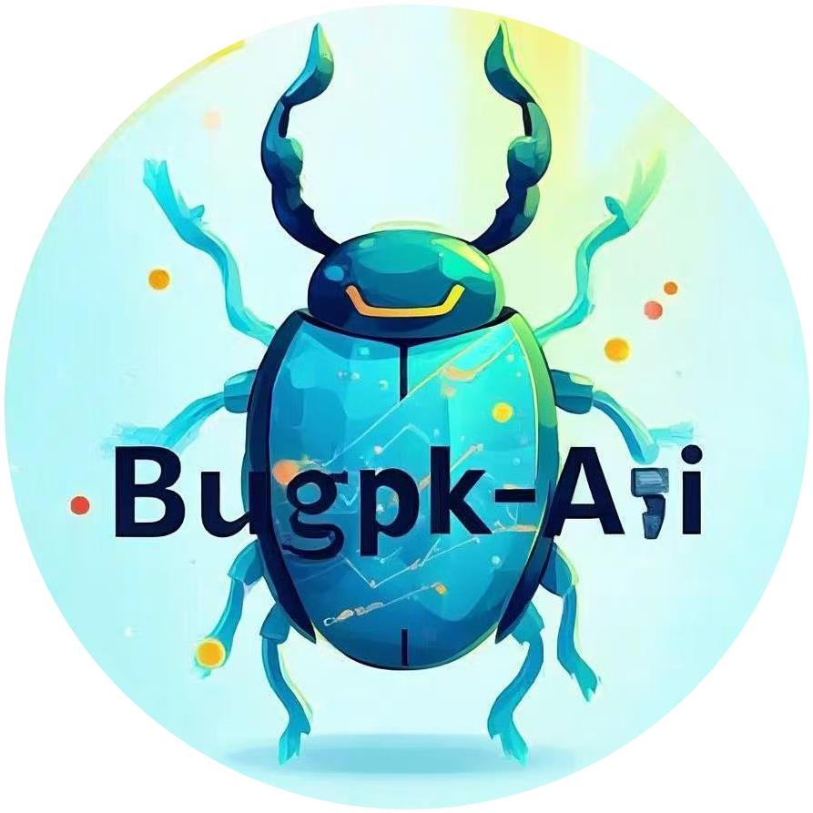

<div align="center">
  
  <h1>短视频去水印解析接口</h1>
  <p><em>支持多平台短视频链接解析与去水印</em></p>
  <div>
    <a href="https://github.com/OpenListTeam/jiuhunwl/short_videos/main/LICENSE" style="text-decoration: none; color: #0366d6; transition: color 0.2s;">
      
    </a>
    <a href="https://php.net" style="text-decoration: none; color: #0366d6; transition: color 0.2s;">
      
    </a>
    <a href="https://github.com/jiuhunwl/short_videos" style="text-decoration: none; color: #0366d6; transition: color 0.2s;">
      
    </a>
  </div>
  <br />
  <div>
    <a href="#项目简介" style="text-decoration: none; color: #0366d6; transition: color 0.2s;">项目简介</a>
    •
    <a href="#重要声明" style="text-decoration: none; color: #0366d6; transition: color 0.2s;">重要声明</a>
    •
    <a href="#功能特点" style="text-decoration: none; color: #0366d6; transition: color 0.2s;">功能特点</a>
    •
    <a href="#支持平台" style="text-decoration: none; color: #0366d6; transition: color 0.2s;">支持平台</a>
    •
    <a href="#安装部署" style="text-decoration: none; color: #0366d6; transition: color 0.2s;">安装部署</a>
    •
    <a href="#使用说明" style="text-decoration: none; color: #0366d6; transition: color 0.2s;">使用说明</a>
    •
    <a href="#接口文档" style="text-decoration: none; color: #0366d6; transition: color 0.2s;">接口文档</a>
    •
    <a href="#贡献指南" style="text-decoration: none; color: #0366d6; transition: color 0.2s;">贡献指南</a>
    •
    <a href="#许可证" style="text-decoration: none; color: #0366d6; transition: color 0.2s;">许可证</a>
    •
    <a href="#联系方式" style="text-decoration: none; color: #0366d6; transition: color 0.2s;">联系方式</a>
    •
    <a href="#公众号" style="text-decoration: none; color: #0366d6; transition: color 0.2s;">公众号</a>
  </div>
</div>

<script>
  // 添加平滑滚动效果
  document.querySelectorAll('a[href^="#"]').forEach(anchor => {
    anchor.addEventListener('click', function (e) {
      e.preventDefault();
      const target = document.querySelector(this.getAttribute('href'));
      if (target) {
        target.scrollIntoView({
          behavior: 'smooth',
          block: 'start'
        });
      }
    });
  });
  // 添加链接悬停效果
  document.querySelectorAll('a').forEach(link => {
    link.addEventListener('mouseenter', function() {
      this.style.color = '#0056b3';
    });
    link.addEventListener('mouseleave', function() {
      this.style.color = '#0366d6';
    });
  });
</script>

---

## 📋 目录

- [项目简介](#项目简介)
- [重要声明](#重要声明)
- [✨ 功能特点](#功能特点)
- [🌐 支持平台](#支持平台)
- [📦 安装部署](#安装部署)
- [🚀 使用说明](#使用说明)
- [📖 接口文档](#接口文档)
- [🤝 贡献指南](#贡献指南)
- [📄 许可证](#许可证)
- [📮 联系方式](#联系方式)
- [📱 公众号](#公众号)

---

<span id="项目简介"></span>

<span id="项目简介"></span>
## 🎯 项目简介

本工具用于解析各大短视频平台的视频链接，获取视频的详细信息，包括：

- 无水印的直链视频地址
- 视频封面图片
- 作者信息
- 视频元数据

所有接口均返回结构化的 JSON 数据，便于快速集成到您的应用中。

---

<span id="重要声明"></span>

## 重要声明

本项目为开源软件，遵循 MIT 许可证。任何个人或组织均可自由使用、修改和分发本项目的源代码。

**然而，我们明确声明：本项目及其任何衍生作品不得用于任何商业或付费项目。**

任何违反此声明的行为都将被视为对本项目许可证的侵犯。

我们鼓励大家在遵守开源精神和许可证的前提下，积极贡献和分享代码。

---

<span id="功能特点"></span>

<span id="功能特点"></span>
## ✨ 功能特点

- **多平台支持**：支持主流短视频平台的链接解析
- **去水印解析**：获取无水印的视频直链
- **极速响应**：快速解析视频链接，响应迅速
- **结构化数据**：返回标准 JSON 格式数据
- **易于集成**：简单的 API 接口，便于集成
- **零配置部署**：无需安装依赖，上传即用

---

<span id="支持平台"></span>

<span id="支持平台"></span>
## 🌐 支持平台

| 平台                 | 接口文件           | 状态   |
|--------------------|----------------|------|
| **抖音** (TikTok 中国) | `douyin.php`   | ✅ 可用 |
| **快手**             | `kuaishou.php` | ✅ 可用 |
| **小红书**            | `xhsjx.php`    | ✅ 可用 |
| **汽水音乐**           | `dymusic.php`  | ✅ 可用 |
| **皮皮搞笑**           | `pipigx.php`   | ✅ 可用 |
| **皮皮虾**            | `ppxia.php`    | ✅ 可用 |
| **哔哩哔哩**           | `bilibili.php` | ✅ 可用 |
| **微博** 【接口版】       | `weibo.php`    | ✅ 可用 |
| **微博**             | `weibo_v.php`  | ✅ 可用 |
| **今日头条**           | `toutiao.php`  | ✅ 可用 |

---

<span id="安装部署"></span>

<span id="安装部署"></span>
## 📦 安装部署

### 环境要求

- **PHP 8.0** 或更高版本
- Web 服务器 (Apache/Nginx)
- 无需额外依赖！

### 1. 下载代码

```bash
git clone https://github.com/jiuhunwl/short_videos.git
cd short_videos
```

### 2. 部署到服务器

将 PHP 文件上传到您的 Web 服务器即可使用，无需任何配置！

---

<span id="使用说明"></span>

<span id="使用说明"></span>
## 🚀 使用说明

### 基础用法

直接通过 URL 访问接口：

```plaintext
https://你的服务器地址/api/xxx.php?url=视频链接
```

### 请求示例

```plaintext
https://api.bugpk.com/api/douyin.php?url=https://v.douyin.com/xxxx/
```

### 响应示例

```json
{
    "code": 200,
    "msg": "解析成功",
    "data": {
        "author": "作者名称",
      "authorID": "123456789",
      "title": "视频标题",
      "desc": "视频描述内容",
      "avatar": "https://example.com/avatar.jpg",
      "cover": "https://example.com/cover.jpg",
      "url": "https://example.com/video.mp4",
      "imgurl": [
        "https://example.com/image1.jpg",
        "https://example.com/image2.jpg"
      ]
    }
}
```

### 📱 抖音 Cookie 获取教程

**重要提示：** 抖音解析可能需要使用 Cookie 以提高解析成功率。

#### 获取步骤：

1. 打开浏览器，访问抖音网页版
2. 登录您的抖音账号
3. 按 F12 打开开发者工具
4. 切换到 Network 标签页
5. 刷新页面，找到一个请求
6. 在请求头中找到 Cookie 字段
7. 复制完整的 Cookie 值

#### 图解教程：

<div align="center">
  
  <p><em>抖音Cookie获取步骤示意图</em></p>
</div>

---

<span id="接口文档"></span>

<span id="接口文档"></span>
## 📖 接口文档

### 请求参数

| 参数名   | 类型  | 描述         | 是否必填 |
|-------|-----|------------|------|
| `url` | 字符串 | 短视频平台的视频链接 | ✅ 是  |

### 响应格式

| 字段              | 类型  | 描述               |
|-----------------|-----|------------------|
| `code`          | 整数  | 响应状态码 (200 = 成功) |
| `msg`           | 字符串 | 响应消息             |
| `data`          | 对象  | 视频数据对象           |
| `data.author`   | 字符串 | 作者名称             |
| `data.authorID` | 字符串 | 作者唯一标识           |
| `data.title`    | 字符串 | 视频标题             |
| `data.desc`     | 字符串 | 视频描述             |
| `data.avatar`   | 字符串 | 作者头像 URL         |
| `data.cover`    | 字符串 | 视频封面图 URL        |
| `data.url`      | 字符串 | 无水印视频直链          |
| `data.imgurl`   | 数组  | 图集图片 URL 数组      |

### 状态码说明

| 状态码   | 描述     |
|-------|--------|
| `200` | 解析成功   |
| `400` | 请求参数错误 |
| `404` | 视频不存在  |
| `500` | 服务器错误  |

---

<span id="贡献指南"></span>

<span id="贡献指南"></span>
## 🤝 贡献指南

欢迎贡献代码！请随时提交 Issue 和 Pull Request。

### 贡献步骤

1. Fork 本仓库
2. 创建特性分支 (`git checkout -b feature/AmazingFeature`)
3. 提交更改 (`git commit -m 'Add some AmazingFeature'`)
4. 推送到分支 (`git push origin feature/AmazingFeature`)
5. 开启 Pull Request

---

<span id="许可证"></span>

<span id="许可证"></span>
## 📄 许可证

本项目采用 MIT 许可证 - 详见 [LICENSE](https://github.com/OpenListTeam/jiuhunwl/short_videos/main/LICENSE) 文件。

---

<span id="联系方式"></span>

<span id="联系方式"></span>
## 📮 联系方式

**作者**：JH-Ahua

**接口演示官网**：[https://api.bugpk.com/](https://api.bugpk.com/)

**反馈邮箱**：[admin@bugpk.com](mailto:admin@bugpk.com)

**GitHub**：[https://github.com/jiuhunwl](https://github.com/jiuhunwl)

---

<span id="公众号"></span>

<span id="公众号"></span>
## 📱 公众号

欢迎关注微信公众号获取更多资讯：

<div align="center">
  <table>
    <tr>
      <td>
        
      </td>
    </tr>
    <tr>
      <td align="center">
        <strong>微信公众号</strong>
      </td>
    </tr>
  </table>
</div>

---

<div align="center">
  <p>⭐ 如果这个项目对您有帮助，请给个 Star 支持一下！</p>
</div>

---

*[English](./README_EN.md)*
