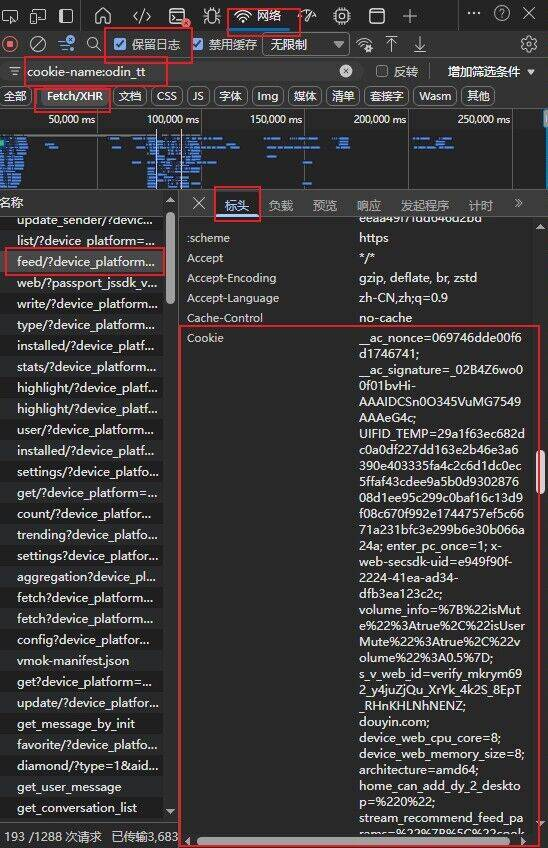

<div align="center">
  
  <h1>Short Video Watermark Removal & Parsing API</h1>
  <p><em>Source code for short video watermark removal and parsing interface</em></p>
  <div>
    <a href="https://github.com/jiuhunwl/short_videos/blob/main/LICENSE" style="text-decoration: none; color: #0366d6; transition: color 0.2s;">
      
    </a>
    <a href="https://php.net" style="text-decoration: none; color: #0366d6; transition: color 0.2s;">
      
    </a>
    <a href="https://github.com/jiuhunwl/short_videos" style="text-decoration: none; color: #0366d6; transition: color 0.2s;">
      
    </a>
  </div>
  <br />
  <div>
    <a href="#about" style="text-decoration: none; color: #0366d6; transition: color 0.2s;">About</a>
    •
    <a href="#important-notice" style="text-decoration: none; color: #0366d6; transition: color 0.2s;">Important Notice</a>
    •
    <a href="#features" style="text-decoration: none; color: #0366d6; transition: color 0.2s;">Features</a>
    •
    <a href="#supported-platforms" style="text-decoration: none; color: #0366d6; transition: color 0.2s;">Platforms</a>
    •
    <a href="#installation" style="text-decoration: none; color: #0366d6; transition: color 0.2s;">Installation</a>
    •
    <a href="#usage" style="text-decoration: none; color: #0366d6; transition: color 0.2s;">Usage</a>
    •
    <a href="#api-reference" style="text-decoration: none; color: #0366d6; transition: color 0.2s;">API Reference</a>
    •
    <a href="#contributing" style="text-decoration: none; color: #0366d6; transition: color 0.2s;">Contributing</a>
    •
    <a href="#license" style="text-decoration: none; color: #0366d6; transition: color 0.2s;">License</a>
    •
    <a href="#contact" style="text-decoration: none; color: #0366d6; transition: color 0.2s;">Contact</a>
  </div>
</div>

<!-- Smooth scrolling and link styles implemented via inline CSS -->

---

## 📋 Table of Contents

- [About](#about)
- [Important Notice](#important-notice)
- [✨ Features](#features)
- [🌐 Supported Platforms](#supported-platforms)
- [📦 Installation](#installation)
- [🚀 Usage](#usage)
- [📖 API Reference](#api-reference)
- [🤝 Contributing](#contributing)
- [📄 License](#license)
- [📮 Contact](#contact)

---

<span id="about"></span>

<span id="about"></span>
## 🎯 About

This tool is designed to parse video links from various short video platforms and extract detailed information such as:

- Direct video URLs (without watermarks)
- Cover images
- Author information
- Video metadata

All responses are returned in structured JSON format for easy integration.

---

<span id="important-notice"></span>

## Important Notice

This project is open-source software licensed under the MIT License. Any individual or organization is free to use,
modify, and distribute the source code.

**However, we explicitly state that this project and any derivative works may NOT be used for commercial or paid
projects.**

Any violation of this statement will be considered an infringement of the project's license terms.

We encourage everyone to contribute and share code in accordance with open-source ethics and licensing terms.

---

<span id="features"></span>

<span id="features"></span>
## ✨ Features

- **Multi-Platform Support**: Parse video links from various short video platforms
- **Watermark Removal**: Get direct video URLs without watermarks
- **Fast Performance**: Quick response times for parsing requests
- **Structured Data**: Returns well-formatted JSON data
- **Easy Integration**: Simple API interface for seamless integration
- **No Installation Required**: Can be used directly on any PHP server

---

<span id="supported-platforms"></span>

<span id="supported-platforms"></span>
## 🌐 Supported Platforms

| Platform                          | API File       | Status   |
|-----------------------------------|----------------|----------|
| **Douyin** (TikTok China)         | `douyin.php`   | ✅ Active |
| **Kuaishou**                      | `kuaishou.php` | ✅ Active |
| **Kuaishou Images**               | `ksimg.php`    | ✅ Active |
| **Xiaohongshu** (Little Red Book) | `xhs.php`      | ✅ Active |
| **Xiaohongshu Images**            | `xhsimg.php`   | ✅ Active |
| **Xiaohongshu Live**              | `xhsjx.php`    | ✅ Active |
| **Qishui Music**                  | `qsmusic.php`  | ✅ Active |
| **Pipigx**                        | `pipigx.php`   | ✅ Active |
| **Pipixia**                       | `ppxia.php`    | ✅ Active |
| **Bilibili**                      | `bilibili.php` | ✅ Active |
| **Weibo** (Interface Version)     | `weibo.php`    | ✅ Active |
| **Weibo**                         | `weibo_v.php`  | ✅ Active |

---

<span id="installation"></span>

<span id="installation"></span>
## 📦 Installation

### Requirements

- **PHP 8.0** or higher
- Web server (Apache/Nginx)
- No additional dependencies required!

### 1. Download the Code

```bash
git clone https://github.com/jiuhunwl/short_videos.git
cd short_videos
```

### 2. Deploy to Server

Upload the PHP files to your web server. No installation or configuration needed!

---

<span id="usage"></span>

<span id="usage"></span>
## 🚀 Usage

### Basic Usage

Access the API directly via URL:

```plaintext
http://your-server-domain/api/xxx.php?url=VIDEO_LINK
```

### Example Request

```plaintext
https://api.bugpk.com/api/douyin.php?url=https://v.douyin.com/xxxx/
```

### Example Response

```json
{
    "code": 200,
    "msg": "Parsing successful",
    "data": {
        "author": "Author Name",
        "authorID": "123456789",
        "title": "Video Title",
        "desc": "Video description content",
        "avatar": "https://example.com/avatar.jpg",
        "cover": "https://example.com/cover.jpg",
        "url": "https://example.com/video.mp4",
        "imgurl": [
            "https://example.com/image1.jpg",
            "https://example.com/image2.jpg"
        ]
    }
}
```

### 📱 Douyin Cookie Acquisition Tutorial

**Important Note:** Douyin parsing may require the use of cookies to improve parsing success rate.

#### Acquisition Steps:

1. Open browser and visit Douyin web version
2. Log in to your Douyin account
3. Press F12 to open developer tools
4. Switch to the Network tab
5. Refresh the page and find a request
6. Find the Cookie field in the request headers
7. Copy the complete Cookie value

#### Visual Tutorial:

<div align="center">
  
  <p><em>Douyin Cookie acquisition steps diagram</em></p>
</div>

---

<span id="api-reference"></span>

<span id="api-reference"></span>
## 📖 API Reference

### Request Parameters

| Parameter | Type   | Description                          | Required |
|-----------|--------|--------------------------------------|----------|
| `url`     | String | Video link from short video platform | ✅ Yes    |

### Response Format

| Field           | Type    | Description                            |
|-----------------|---------|----------------------------------------|
| `code`          | Integer | Response status code (200 = success)   |
| `msg`           | String  | Response message                       |
| `data`          | Object  | Video data object                      |
| `data.author`   | String  | Author's name                          |
| `data.authorID` | String  | Author's unique ID                     |
| `data.title`    | String  | Video title                            |
| `data.desc`     | String  | Video description                      |
| `data.avatar`   | String  | Author's avatar URL                    |
| `data.cover`    | String  | Video cover image URL                  |
| `data.url`      | String  | Direct video URL (without watermark)   |
| `data.imgurl`   | Array   | Array of image URLs (for image albums) |

### Status Codes

| Code  | Description                |
|-------|----------------------------|
| `200` | Parsing successful         |
| `400` | Invalid request parameters |
| `404` | Video not found            |
| `500` | Server error               |

---

<span id="contributing"></span>

<span id="contributing"></span>
## 🤝 Contributing

Contributions are welcome! Please feel free to submit issues and pull requests.

### How to Contribute

1. Fork the repository
2. Create your feature branch (`git checkout -b feature/AmazingFeature`)
3. Commit your changes (`git commit -m 'Add some AmazingFeature'`)
4. Push to the branch (`git push origin feature/AmazingFeature`)
5. Open a Pull Request

---

<span id="license"></span>

<span id="license"></span>
## 📄 License

This project is licensed under the MIT License - see
the [LICENSE](https://github.com/jiuhunwl/short_videos/blob/main/LICENSE) file for details.

---

<span id="contact"></span>

<span id="contact"></span>
## 📮 Contact

**Author**: JH-Ahua

**Official Demo Website**: [https://api.bugpk.com/](https://api.bugpk.com/)

**Feedback Email**: [admin@bugpk.com](mailto:admin@bugpk.com)

**GitHub**: [https://github.com/jiuhunwl](https://github.com/jiuhunwl)

---

<div align="center">
  <p>⭐ If you find this project useful, please give it a star!</p>
</div>

---

*[中文](./README.md)*
